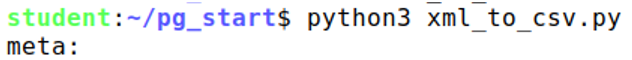

# StackExchange Data Migration to PostgreSQL

## Задача:
Перенос схемы и данных StackExchange (dba.stackexchange.org и dba.meta.stackexchange.org) из Data Dump-архивов в PostgreSQL с последующим восстановлением связей между таблицами, выполнением запросов и оптимизацией.

---

## Инструкция по запуску

Перед началом работы добавьте в корень проекта две папки с распакованными дампами:

- `meta` — содержит данные с сайта `dba.meta.stackexchange.com`. Эта папка уже находится в нужном месте.
- `main` — распакуйте дамп `dba.stackexchange.com` в эту папку.

Итоговая структура:
```
project-root/
├── main/           # дамп dba.stackexchange.com
├── meta/           # дамп dba.meta.stackexchange.com
├── fields.py
├── xml_to_csv.py
├── cleaning_files.py
├── ...
```
### Пример запуска скриптов
Скрипты удобно запускать из корневой директории проекта.

Запуск Python файла:



Запуск SQL файла:


### Порядок запуска скриптов:

1. **`fields.py`**  
   Проверяет, какие поля реально присутствуют в XML-файлах дампа, чтобы при создании схемы учесть только нужные столбцы. Выводит список актуальных полей по каждой таблице. Не забудьте про requirements.txt

2. **`xml_to_csv.py`**  
   Преобразует XML-файлы в CSV-формат. Это позволяет в дальнейшем использовать команду `COPY` для быстрой загрузки данных в PostgreSQL. Новые файлы помещаются в папку `output`, которая будет создана автоматически.

3. **`cleaning_files.py`**  
   Проверяет соответствие данных заявленным первичным и внешним ключам.  
   Скрипт создаёт очищенные версии CSV-файлов с суффиксом `_cleaning`.  
   Оригинальные файлы удаляются для экономии места на диске.

После выполнения этих шагов можно переходить к созданию схемы и загрузке данных в базу.

4. **`create_schema.sql`**  
   Создаёт схему базы данных на основе таблиц, реально присутствующих в дампе.  
   На этом этапе **не накладываются первичные и внешние ключи**, чтобы ускорить массовую вставку данных.

5. **`data_import.sql`**  
   Загружает очищенные CSV-файлы в базу данных с помощью команды `COPY`.  
   Файлы берутся из папки `output`, и должны иметь суффикс `_cleaning.csv`.

6. **`table_keys.sql`**  
   После загрузки данных задаёт первичные и внешние ключи для всех таблиц, устанавливая связи между ними.

7. **`table_PostTags_and_indexes.sql`**  
   - Создаёт и заполняет таблицу `PostTags`, которая реализует связь "многие-ко-многим" между таблицами `Posts` и `Tags`.
   - Создаёт индексы:
     - На внешние ключи для ускорения JOIN и каскадных операций.
     - На поля, которые активно используются в конкретных запросах **Q1** и **Q2** (детали будут рассмотрены далее).

После этого можно перейти к запросам Q1 и Q2. Их можно выполнять в любом порядке.

## Аппаратная и программная среда

Перед тем как перейти к выполнению SQL-запросов, рассмотрим используемую среду выполнения:

- **PostgreSQL 16**
- Установлен на виртуальной машине
- **Оперативная память:** 2 ГБ
- **Хранилище:** SSD ноутбука, доступ через **виртуальный диск (SATA)**

---

## Рекомендованная конфигурация PostgreSQL

Чтобы PostgreSQL эффективно работал в условиях ограниченных ресурсов (2 ГБ ОЗУ), в `postgresql.conf` стоит задать следующие параметры:

```conf
# Общая память
shared_buffers = 512MB              # ~25% от доступной RAM, используемой PostgreSQL
work_mem = 8MB                      # Немного увеличим память на каждую операцию сортировки/хэша в запросах
maintenance_work_mem = 128MB       # Используется при ANALYZE, VACUUM, создании индексов

# Параметры записи WAL
wal_buffers = 16MB
min_wal_size = 512MB
max_wal_size = 1GB                 # Увеличим, чтобы растянуть процесс записи большого объёма новых данных на более продолжительное время

# Параметры параллелизма
max_parallel_workers = 2           # Полезно при аналитических запросах
parallel_setup_cost = 1000         # Уменьшено, чтобы чаще использовать параллельные планы
parallel_tuple_cost = 0.1

# Автоочистка
autovacuum = on
autovacuum_naptime = 1min

effective_cache_size = 1536MB     # 75% RAM. Указывает планировщику запросов, сколько памяти может быть кэшировано системой. Повышает вероятность выбора индексов.

SET random_page_cost = 1.5        # Для SSD рекомендуемое значение около 1, но так как у меня доступ к SSD через Виртуальный SATA-диск, то 1.5 будет компромисным значением.
```

Параметры подобраны для сбалансированной работы PostgreSQL в условиях ограниченных ресурсов.

##  Индексы

Для ускорения выполнения `JOIN`-операций и каскадных удалений были созданы **индексы на внешние ключи**. В некоторых случаях применялись **частичные индексы**, например:

```sql
CREATE INDEX IF NOT EXISTS idx_posts_acceptedanswerid
ON stackexchange_data.posts(AcceptedAnswerId)
WHERE AcceptedAnswerId IS NOT NULL;
```

Такое решение принималось после анализа статистики — если в столбце много `NULL`, и эти NULL-значения логически не участвуют в запросах, то **частичный индекс** экономит место и повышает производительность.

Также при проектировании структуры индексов я придерживался принципа:

> *Суммарный объём всех индексов по таблице не должен превышать половину её объёма.*

Это помогает избежать **засорения таблицы** лишними индексами, которые редко используются.

---

### Особые индексы

Некоторые индексы были созданы **не только на внешние ключи**, а под конкретные сценарии использования:

1. **Индекс по `Score` в `Posts`**

```sql
CREATE INDEX IF NOT EXISTS idx_posts_score
ON stackexchange_data.posts(score);
```

Этот индекс используется для **сортировок и фильтраций по рейтингу**, что является довольно частым сценарием.

---

2. **GIN-индекс по полю `Tags` с использованием `pg_trgm`**

```sql
CREATE EXTENSION IF NOT EXISTS pg_trgm;

CREATE INDEX IF NOT EXISTS tags_trgm_idx
ON stackexchange_data.posts
USING GIN (tags gin_trgm_ops);
```

Этот индекс помогает при **поиске по частичному совпадению в поле `Tags`**, например:

```sql
WHERE tags LIKE '%postgresql%'
```

> Практика показала, что фильтрация по подстроке в тегах — востребованная операция. Этот индекс существенно улучшает время отклика таких запросов.

---

Все созданные индексы описаны в файле [`table_PostTags_and_indexes.sql`](table_PostTags_and_indexes.sql) и применяются в практических задачах, включая `Q1` и `Q2`.


## Q1 — "Репутационные пары"

### Условие задачи

Запрос анализирует, какие теги задаются одновременно, как быстро на них отвечают и как это связано с репутацией пользователей.  
Он выполняет следующие действия:

- Находит **пары тегов**, которые **часто встречаются вместе** в вопросах.
- В выборку попадают **только вопросы с тегом `postgresql`**.
- Определяет **среднее время ответа** на такие вопросы.
- Сопоставляет ответы с **репутацией пользователей**, которые их дали.

---

### Логика запроса

SQL-запрос находится в файле [`Q1_with_PostTags.sql`](Q1_with_PostTags.sql).

- Запрос объединяет таблицы `Posts`, `PostTags`, `Tags`, `Users`, чтобы получить все нужные данные.
- Через `JOIN` создаются пары тегов, исключая сам `postgresql`, так как:
  > *«Хотя это явно не было сказано в задании, мне показалось логичным исключить тег `postgresql` из итоговых пар, так как он обязателен по условию.»*
- Используется группировка по парам тегов, и считаются:
  - Количество таких вопросов
  - Среднее время ответа
  - Средняя репутация авторов ответов

---

### Оптимизация и индексы

План запроса показывает, что он **эффективно использует имеющиеся индексы**, особенно радуют индексы на таблице `PostTags`:

```text
->  Index Only Scan using idx_posttags_postid_tagid on posttags pt2
->  Parallel Index Only Scan using idx_posttags_postid_tagid on posttags pt1
```

Тем не менее, **время выполнения остаётся заметным** из-за большого количества `JOIN`, даже с учётом того, что они покрыты индексами. Этого можно было ожидать при работе с большими таблицами, особенно при создании попарных сочетаний тегов.
